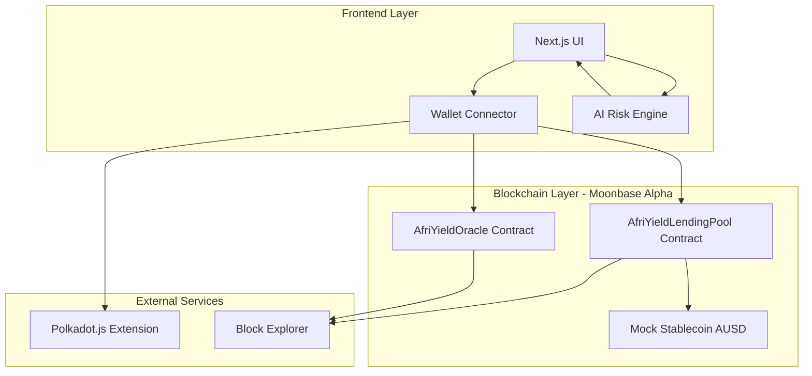
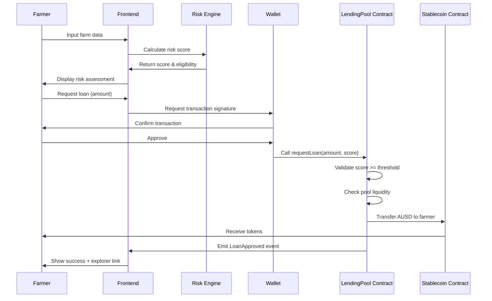
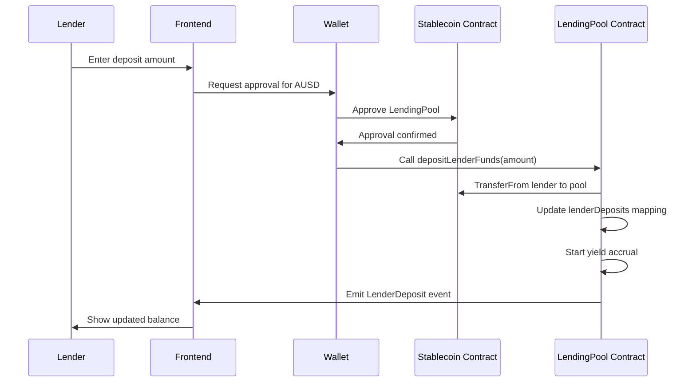

# Design Document: AfriYield Lending Platform

## Overview

AfriYield is a decentralized micro-lending platform built on Polkadot's Moonbase Alpha testnet that connects smallholder farmers in East Africa with lenders through AI-powered risk assessment. The system consists of three main layers:

1. **Smart Contract Layer**: Solidity contracts deployed on Moonbase Alpha handling lending pool management, loan operations, and risk score storage
2. **Frontend Layer**: Next.js/TypeScript application providing user interfaces for farmers, lenders, and transparency dashboards
3. **AI Risk Assessment Layer**: Client-side JavaScript algorithm calculating creditworthiness scores from farm data inputs

The platform enables farmers to receive instant micro-loans (50-500 AUSD) based on AI-calculated risk scores, while lenders earn fixed APY yields on deposited stablecoins. All operations are transparent and verifiable on-chain.

## Architecture

### High-Level System Architecture



### Technology Stack

**Blockchain/Smart Contracts:**
- Solidity ^0.8.20
- OpenZeppelin Contracts v5.0 (ERC20, ReentrancyGuard, Ownable)
- Hardhat for development, testing, and deployment
- Moonbase Alpha testnet (Moonbeam EVM parachain)

**Frontend:**
- Next.js 14 with TypeScript
- @polkadot/api and @polkadot/extension-dapp for wallet integration
- Tailwind CSS for styling
- Chart.js for data visualization
- Ethers.js v6 for contract interactions

**AI/Risk Scoring:**
- Client-side weighted scoring algorithm
- Optional: TensorFlow.js for advanced ML models

e
## Components and Interfaces

### Smart Contract Components

#### 1. AfriYieldLendingPool Contract

**Purpose**: Core lending pool managing deposits, loans, and repayments.

**State Variables:**
```solidity
IERC20 public stablecoin;              // Mock AUSD token
uint256 public totalDeposits;          // Total lender deposits
uint256 public totalLoans;             // Total active loans
uint256 public constant APY = 8;       // 8% annual yield
uint256 public constant RISK_THRESHOLD = 70;
uint256 public loanCounter;            // Unique loan IDs

struct Loan {
    address borrower;
    uint256 amount;
    uint256 riskScore;
    uint256 timestamp;
    uint256 dueDate;
    bool isActive;
    bool isRepaid;
}

mapping(uint256 => Loan) public loans;
mapping(address => uint256[]) public borrowerLoans;
mapping(address => uint256) public lenderDeposits;
mapping(address => uint256) public lenderYields;
```

**Key Functions:**
- `depositLenderFunds(uint256 amount)`: Lenders deposit stablecoins
- `requestLoan(uint256 amount, uint256 riskScore)`: Farmers request loans
- `repayLoan(uint256 loanId)`: Farmers repay loans
- `withdrawFunds(uint256 amount)`: Lenders withdraw principal + yields
- `calculateYield(address lender)`: Calculate accrued yields
- `getLoanDetails(uint256 loanId)`: Retrieve loan information
- `getAllLoans()`: Get all loans for transparency dashboard

**Events:**
```solidity
event LenderDeposit(address indexed lender, uint256 amount);
event LoanRequested(uint256 indexed loanId, address indexed borrower, uint256 amount, uint256 riskScore);
event LoanApproved(uint256 indexed loanId, address indexed borrower, uint256 amount);
event LoanRepaid(uint256 indexed loanId, address indexed borrower, uint256 amount);
event YieldAccrued(address indexed lender, uint256 amount);
event FundsWithdrawn(address indexed lender, uint256 amount);
```

**Security Measures:**
- ReentrancyGuard on all fund transfer functions
- SafeERC20 for token operations
- Access control for administrative functions
- Input validation for amounts and risk scores

#### 2. AfriYieldOracle Contract

**Purpose**: Store and manage risk scores on-chain for transparency.

**State Variables:**
```solidity
mapping(address => uint256) public riskScores;
mapping(address => uint256) public lastUpdated;
address public owner;
```

**Key Functions:**
- `updateRiskScore(address farmer, uint256 score)`: Store risk score
- `getRiskScore(address farmer)`: Retrieve risk score
- `authorizeScorer(address scorer)`: Add authorized risk assessors

**Events:**
```solidity
event RiskScoreUpdated(address indexed farmer, uint256 score, uint256 timestamp);
```

#### 3. MockStablecoin Contract

**Purpose**: ERC-20 test token representing AUSD for testnet operations.

**Implementation:**
```solidity
contract MockStablecoin is ERC20 {
    constructor() ERC20("AfriYield USD", "AUSD") {
        _mint(msg.sender, 1000000 * 10**18); // 1M tokens
    }
    
    function mint(address to, uint256 amount) external {
        _mint(to, amount); // Faucet functionality
    }
}
```


### Frontend Components

#### 1. Wallet Connection Component

**File**: `components/WalletConnect.tsx`

**Responsibilities:**
- Detect Polkadot.js or Talisman extension
- Connect/disconnect wallet
- Display connected address and balances
- Handle wallet state management

**Key Functions:**
```typescript
interface WalletState {
  address: string | null;
  isConnected: boolean;
  balance: {
    dot: string;
    ausd: string;
  };
}

async function connectWallet(): Promise<void>
async function disconnectWallet(): Promise<void>
async function getBalance(address: string): Promise<Balance>
```

#### 2. Farmer Dashboard Component

**File**: `pages/farmer.tsx`

**Sub-components:**
- `FarmDataForm`: Input form for crop data
- `RiskScoreGauge`: Visual display of calculated risk score
- `LoanRequestForm`: Loan amount input and submission
- `ActiveLoansTable`: Display farmer's active loans

**State Management:**
```typescript
interface FarmData {
  cropType: 'Coffee' | 'Maize' | 'Beans' | 'Tea' | 'Cassava';
  estimatedYield: number;    // 0-100 tons/ha
  soilQuality: number;       // 0-100
  rainfall: number;          // mm
  marketVolatility: number;  // 0-100
}

interface RiskAssessment {
  score: number;
  isEligible: boolean;
  breakdown: {
    yieldContribution: number;
    soilContribution: number;
    rainfallContribution: number;
    volatilityPenalty: number;
  };
}
```

#### 3. AI Risk Engine Module

**File**: `lib/riskEngine.ts`

**Algorithm:**
```typescript
function calculateRiskScore(data: FarmData): RiskAssessment {
  // Normalize rainfall (optimal range: 800-1500mm)
  const rainfallScore = normalizeRainfall(data.rainfall);
  
  // Calculate weighted score
  const score = 
    (data.estimatedYield * 0.4) +
    (data.soilQuality * 0.3) +
    (rainfallScore * 0.2) -
    (data.marketVolatility * 0.1);
  
  // Clamp to 0-100 range
  const finalScore = Math.max(0, Math.min(100, score));
  
  return {
    score: finalScore,
    isEligible: finalScore >= 70,
    breakdown: {
      yieldContribution: data.estimatedYield * 0.4,
      soilContribution: data.soilQuality * 0.3,
      rainfallContribution: rainfallScore * 0.2,
      volatilityPenalty: data.marketVolatility * 0.1
    }
  };
}

function normalizeRainfall(rainfall: number): number {
  // Optimal: 800-1500mm = 100 score
  // Below 400mm or above 2000mm = 0 score
  if (rainfall >= 800 && rainfall <= 1500) return 100;
  if (rainfall < 400 || rainfall > 2000) return 0;
  if (rainfall < 800) return (rainfall - 400) / 4;
  return 100 - ((rainfall - 1500) / 5);
}
```

#### 4. Lender Dashboard Component

**File**: `pages/lender.tsx`

**Sub-components:**
- `DepositForm`: Deposit stablecoins to pool
- `PoolStats`: Display pool metrics (balance, APY, active loans)
- `YieldTracker`: Show accrued yields over time
- `WithdrawForm`: Withdraw principal and yields

**State Management:**
```typescript
interface LenderState {
  totalDeposited: string;
  accruedYield: string;
  poolBalance: string;
  activeLoansCount: number;
  currentAPY: number;
  lastYieldUpdate: number;
}
```

#### 5. Transparency Dashboard Component

**File**: `pages/transparency.tsx`

**Features:**
- Paginated table of all loans
- Filters by status (Active, Repaid, Defaulted)
- Aggregate statistics
- Real-time updates via blockchain events

**Data Structure:**
```typescript
interface LoanDisplay {
  loanId: number;
  borrower: string;        // Truncated address
  amount: string;
  riskScore: number;
  status: 'Active' | 'Repaid' | 'Defaulted';
  dueDate: Date;
  transactionHash: string;
}

interface AggregateStats {
  totalLoansIssued: number;
  totalVolume: string;
  averageRiskScore: number;
  repaymentRate: number;
  activeLoans: number;
}
```

#### 6. Contract Interaction Service

**File**: `lib/contractService.ts`

**Purpose**: Abstraction layer for all smart contract interactions.

**Key Functions:**
```typescript
class ContractService {
  private lendingPool: Contract;
  private oracle: Contract;
  private stablecoin: Contract;
  
  async depositFunds(amount: BigNumber): Promise<TransactionReceipt>
  async requestLoan(amount: BigNumber, riskScore: number): Promise<TransactionReceipt>
  async repayLoan(loanId: number): Promise<TransactionReceipt>
  async withdrawFunds(amount: BigNumber): Promise<TransactionReceipt>
  async getLoanDetails(loanId: number): Promise<Loan>
  async getAllLoans(): Promise<Loan[]>
  async getPoolStats(): Promise<PoolStats>
  async updateRiskScore(address: string, score: number): Promise<TransactionReceipt>
}
```


## Data Models

### Blockchain Data Models

#### Loan Structure
```solidity
struct Loan {
    address borrower;        // Farmer's wallet address
    uint256 amount;          // Loan amount in AUSD (wei)
    uint256 riskScore;       // AI-calculated score (0-100)
    uint256 timestamp;       // Block timestamp of loan creation
    uint256 dueDate;         // Repayment deadline (timestamp + 90 days)
    bool isActive;           // True if loan is currently active
    bool isRepaid;           // True if loan has been repaid
}
```

#### Lender Deposit Tracking
```solidity
mapping(address => uint256) public lenderDeposits;    // Principal deposited
mapping(address => uint256) public lenderYields;      // Accrued yields
mapping(address => uint256) public depositTimestamp;  // For yield calculation
```

### Frontend Data Models

#### Farm Data Input Model
```typescript
interface FarmData {
  cropType: CropType;
  estimatedYield: number;      // tons/hectare (0-100)
  soilQuality: number;         // quality score (0-100)
  rainfall: number;            // millimeters
  marketVolatility: number;    // volatility index (0-100)
}

type CropType = 'Coffee' | 'Maize' | 'Beans' | 'Tea' | 'Cassava';
```

#### Risk Assessment Model
```typescript
interface RiskAssessment {
  score: number;                    // Final risk score (0-100)
  isEligible: boolean;              // score >= 70
  breakdown: {
    yieldContribution: number;      // yield * 0.4
    soilContribution: number;       // soil * 0.3
    rainfallContribution: number;   // normalized_rainfall * 0.2
    volatilityPenalty: number;      // volatility * 0.1
  };
  recommendation: string;           // Human-readable explanation
}
```

#### Transaction State Model
```typescript
interface TransactionState {
  status: 'idle' | 'pending' | 'success' | 'error';
  hash?: string;
  error?: string;
  explorerUrl?: string;
}
```

#### Pool Statistics Model
```typescript
interface PoolStatistics {
  totalDeposits: BigNumber;
  totalLoans: BigNumber;
  availableLiquidity: BigNumber;
  activeLoansCount: number;
  currentAPY: number;
  totalLenders: number;
  totalBorrowers: number;
}
```

### Local Storage Models

#### User Preferences
```typescript
interface UserPreferences {
  darkMode: boolean;
  demoMode: boolean;
  connectedWallet: string | null;
  lastVisited: number;
}
```

## Data Flow Diagrams

### Loan Request Flow


### Lender Deposit Flow



## Correctness Properties

A property is a characteristic or behavior that should hold true across all valid executions of a system—essentially, a formal statement about what the system should do. Properties serve as the bridge between human-readable specifications and machine-verifiable correctness guarantees.

### Smart Contract Properties

**Property 1: Deposit increases pool balance**
*For any* valid deposit amount, when a lender deposits funds, the total pool balance should increase by exactly that amount.
**Validates: Requirements 7.3**

**Property 2: Loan approval transfers correct amount**
*For any* approved loan with amount A and risk score >= 70, the borrower's stablecoin balance should increase by A and the pool balance should decrease by A.
**Validates: Requirements 3.8, 7.5**

**Property 3: Loan approval emits event**
*For any* approved loan, a LoanApproved event should be emitted containing the borrower address, loan amount, and risk score.
**Validates: Requirements 3.9, 7.7**

**Property 4: Repayment returns funds to pool**
*For any* loan repayment, the pool balance should increase by the repayment amount and the loan status should change to "Repaid".
**Validates: Requirements 5.5, 7.9**

**Property 5: Repayment emits event**
*For any* completed repayment, a LoanRepaid event should be emitted with the borrower address and amount.
**Validates: Requirements 5.6**

**Property 6: Pool accounting invariant**
*For any* sequence of deposits, loans, and repayments, the equation (totalDeposits - totalLoans + totalRepayments) should equal the current pool balance.
**Validates: Requirements 7.10**

**Property 7: Risk score storage round-trip**
*For any* valid risk score (0-100), storing then retrieving the score for an address should return the same value.
**Validates: Requirements 8.1, 8.2**

**Property 8: Risk score validation**
*For any* risk score input, values between 0-100 should be accepted, and values outside this range should be rejected.
**Validates: Requirements 8.3**

**Property 9: Access control enforcement**
*For any* unauthorized address attempting to update risk scores, the transaction should revert. For authorized addresses, updates should succeed.
**Validates: Requirements 8.4, 12.4**

**Property 10: Risk score update emits event**
*For any* successful risk score update, a RiskScoreUpdated event should be emitted with the farmer address, score, and timestamp.
**Validates: Requirements 8.5**

**Property 11: Insufficient liquidity rejection**
*For any* loan request where the requested amount exceeds available pool balance, the transaction should revert with an appropriate error.
**Validates: Requirements 3.7**

**Property 12: Withdrawal liquidity protection**
*For any* withdrawal request that would leave insufficient funds for active loans, the transaction should revert.
**Validates: Requirements 4.8**

### Frontend Properties

**Property 13: Risk score calculation accuracy**
*For any* valid farm data inputs (yield, soil, rainfall, volatility), the calculated risk score should equal: (yield × 0.4) + (normalizedRainfall × 0.3) + (soil × 0.2) - (volatility × 0.1), clamped to 0-100.
**Validates: Requirements 2.7**

**Property 14: Risk score color coding**
*For any* calculated risk score, the gauge color should be green if score >= 70, yellow if 50 <= score < 70, and red if score < 50.
**Validates: Requirements 2.8**

**Property 15: Loan interface enablement**
*For any* risk score >= 70, the loan request interface should be enabled. For any score < 70, it should be disabled.
**Validates: Requirements 3.1, 3.2**

**Property 16: Input validation - crop type**
*For any* crop type selection, only values from the list (Coffee, Maize, Beans, Tea, Cassava) should be accepted.
**Validates: Requirements 2.2**

**Property 17: Input validation - yield**
*For any* yield input, values between 0-100 should be accepted, and values outside this range should be rejected.
**Validates: Requirements 2.3**

**Property 18: Input validation - soil quality**
*For any* soil quality slider value, only values between 0-100 should be accepted.
**Validates: Requirements 2.4**

**Property 19: Input validation - rainfall**
*For any* rainfall input, positive numbers should be accepted, and negative or non-numeric values should be rejected.
**Validates: Requirements 2.5**

**Property 20: Input validation - loan amount**
*For any* loan amount input, values between 50-500 should be accepted, and values outside this range should be rejected.
**Validates: Requirements 3.3**

**Property 21: Wallet connection state management**
*For any* wallet connection, the displayed address should match the connected wallet, and disconnection should clear all session data.
**Validates: Requirements 1.4, 1.6**

**Property 22: Balance display accuracy**
*For any* connected wallet, the displayed DOT and AUSD balances should match the actual on-chain balances.
**Validates: Requirements 1.5**

**Property 23: Transaction status display**
*For any* submitted transaction, the UI should display status updates (pending, success, or failed) and provide an explorer link on success.
**Validates: Requirements 3.5, 3.6**

**Property 24: Address truncation**
*For any* Ethereum address displayed, it should be truncated to the format "0x[first4]...[last4]" for readability.
**Validates: Requirements 6.2**

**Property 25: Aggregate statistics accuracy**
*For any* set of loans, the displayed aggregate statistics (total loans, average risk score, repayment rate) should be calculated correctly from the loan data.
**Validates: Requirements 6.3**

**Property 26: Real-time dashboard updates**
*For any* loan creation or repayment event, the transparency dashboard should update to reflect the new state within a reasonable time.
**Validates: Requirements 6.5**

**Property 27: Yield calculation accuracy**
*For any* lender deposit with amount A and time period T, the accrued yield should equal A × APY × (T / 365 days).
**Validates: Requirements 4.5**

**Property 28: Dark mode persistence**
*For any* dark mode preference selection, the preference should persist across browser sessions.
**Validates: Requirements 9.5**

**Property 29: Form validation display**
*For any* invalid form input, inline validation errors should be displayed to the user.
**Validates: Requirements 9.6**

**Property 30: Dual-layer input validation**
*For any* user input, validation should occur on both the client-side (frontend) and contract-side (smart contract).
**Validates: Requirements 12.3**

**Property 31: Event emission for sensitive operations**
*For any* sensitive operation (deposit, loan request, repayment, withdrawal), the smart contract should emit an appropriate event.
**Validates: Requirements 12.5**


## Error Handling

### Smart Contract Error Handling

**Insufficient Liquidity Errors:**
- Revert with "Insufficient pool balance" when loan request exceeds available funds
- Revert with "Insufficient liquidity for withdrawal" when withdrawal would compromise active loans

**Validation Errors:**
- Revert with "Risk score below threshold" when score < 70
- Revert with "Invalid risk score" when score > 100
- Revert with "Invalid loan amount" when amount < 50 or > 500
- Revert with "Loan not found" when accessing non-existent loan ID
- Revert with "Loan already repaid" when attempting to repay completed loan

**Access Control Errors:**
- Revert with "Unauthorized" when non-owner attempts admin functions
- Revert with "Not authorized to update scores" for oracle access violations

**Token Transfer Errors:**
- Use SafeERC20 to handle failed transfers gracefully
- Revert with descriptive messages on approval failures

### Frontend Error Handling

**Wallet Connection Errors:**
```typescript
try {
  await connectWallet();
} catch (error) {
  if (error.code === 'EXTENSION_NOT_FOUND') {
    showError('Please install Talisman or Polkadot.js extension');
  } else if (error.code === 'USER_REJECTED') {
    showError('Connection rejected by user');
  } else {
    showError('Failed to connect wallet. Please try again.');
  }
}
```

**Transaction Errors:**
```typescript
try {
  const tx = await contract.requestLoan(amount, riskScore);
  await tx.wait();
} catch (error) {
  if (error.code === 'INSUFFICIENT_FUNDS') {
    showError('Insufficient balance for transaction');
  } else if (error.message.includes('Risk score below threshold')) {
    showError('Your risk score is too low for this loan amount');
  } else if (error.message.includes('Insufficient pool balance')) {
    showError('Lending pool has insufficient funds. Please try a smaller amount.');
  } else {
    showError(`Transaction failed: ${error.message}`);
  }
}
```

**Input Validation Errors:**
- Display inline error messages for invalid form inputs
- Prevent form submission until all validations pass
- Provide helpful hints for correct input formats

**Network Errors:**
- Detect network disconnections and display reconnection prompts
- Handle RPC endpoint failures with fallback providers
- Show loading states during network operations

## Testing Strategy

### Smart Contract Testing

**Unit Tests (Hardhat + Chai):**
- Test each contract function individually
- Verify state changes after operations
- Test access control modifiers
- Verify event emissions
- Test edge cases (zero amounts, boundary values)
- Test error conditions and reverts

**Property-Based Tests (Hardhat + fast-check):**
- Use fast-check library for property-based testing in JavaScript/TypeScript
- Minimum 100 iterations per property test
- Each property test must reference its design document property number
- Tag format: `// Feature: afriyield-lending-platform, Property X: [property text]`

**Example Property Test:**
```typescript
import fc from 'fast-check';

// Feature: afriyield-lending-platform, Property 1: Deposit increases pool balance
it('should increase pool balance by deposit amount', async () => {
  await fc.assert(
    fc.asyncProperty(
      fc.bigUint(1000000), // Random deposit amount
      async (depositAmount) => {
        const initialBalance = await lendingPool.totalDeposits();
        await stablecoin.approve(lendingPool.address, depositAmount);
        await lendingPool.depositLenderFunds(depositAmount);
        const finalBalance = await lendingPool.totalDeposits();
        expect(finalBalance.sub(initialBalance)).to.equal(depositAmount);
      }
    ),
    { numRuns: 100 }
  );
});
```

**Integration Tests:**
- Test complete user flows (deposit → loan → repayment)
- Test interactions between LendingPool and Oracle contracts
- Test token transfer flows

**Security Tests:**
- Test reentrancy protection
- Test access control enforcement
- Test integer overflow/underflow protection (via SafeMath)
- Test front-running scenarios

### Frontend Testing

**Unit Tests (Jest + React Testing Library):**
- Test individual components in isolation
- Test utility functions (risk calculation, address truncation)
- Test state management logic
- Test form validation logic

**Property-Based Tests (fast-check):**
- Test risk score calculation with random inputs
- Test input validation with random values
- Test address formatting with random addresses
- Minimum 100 iterations per property test

**Example Frontend Property Test:**
```typescript
import fc from 'fast-check';

// Feature: afriyield-lending-platform, Property 13: Risk score calculation accuracy
test('risk score calculation is accurate', () => {
  fc.assert(
    fc.property(
      fc.integer({ min: 0, max: 100 }), // yield
      fc.integer({ min: 0, max: 100 }), // soil
      fc.integer({ min: 0, max: 3000 }), // rainfall
      fc.integer({ min: 0, max: 100 }), // volatility
      (yield, soil, rainfall, volatility) => {
        const result = calculateRiskScore({ yield, soil, rainfall, volatility });
        const normalizedRainfall = normalizeRainfall(rainfall);
        const expected = Math.max(0, Math.min(100,
          (yield * 0.4) + (soil * 0.3) + (normalizedRainfall * 0.2) - (volatility * 0.1)
        ));
        expect(result.score).toBeCloseTo(expected, 2);
      }
    ),
    { numRuns: 100 }
  );
});
```

**Integration Tests:**
- Test complete user flows (connect wallet → assess credit → request loan)
- Test contract interaction flows
- Test event listening and UI updates

**E2E Tests (Playwright - Optional):**
- Test critical paths on deployed testnet
- Test wallet connection flow
- Test loan request and approval flow
- Test transparency dashboard

### Test Coverage Goals

- Smart Contracts: 100% function coverage, 90%+ branch coverage
- Frontend: 80%+ coverage for critical paths
- All correctness properties must have corresponding property tests
- All error conditions must have unit tests

### Continuous Testing

- Run unit tests on every commit
- Run property tests in CI/CD pipeline
- Deploy to testnet for integration testing
- Manual testing checklist for demo preparation

